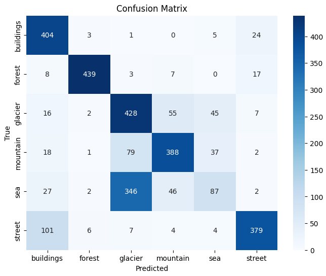

# 🧠 *Intel Image Classification with CNN*

## 📌 Project Overview

This project focuses on building a Convolutional Neural Network (CNN) for image classification using the Intel Image Classification Dataset.

The goal is to gain practical experience in deep learning, covering:
* Data preprocessing & augmentation
* CNN model design and training
* Model evaluation with metrics and visualizations
* Interpretation of model decisions using Grad-CAM

## 📂 Dataset
* Source: Intel Image Classification Dataset on Kaggle
* Classes:
  * 🏢 Buildings
  * 🌳 Forest
  * 🧊 Glacier
  * ⛰️ Mountain
  * 🌊 Sea
  * 🛣️ Street
* Size: 25,000+ images (150x150 pixels)

## ⚙️ *Methods & Workflow*
1. Data Preprocessing
   * Resizing & normalization
   * Train/validation/test split
   * Data augmentation (rotation, flip, zoom, color jitter, etc.)

2. Model Development
   * CNN architecture with:
      * Convolutional layers
      * Pooling layers
      * Dense (fully connected) layers
      * Dropout for regularization
      * Activation functions (ReLU, Softmax)
   * (Optional) Transfer Learning with pretrained models

3. Model Evaluation
   * Accuracy & loss plots
   * Confusion Matrix & Classification Report
   * Grad-CAM visualizations for interpretability

4. Hyperparameter Tuning
   * Learning rate, batch size, dropout rate, optimizer
   * Experiments with number of layers & filters
   * Overfitting/underfitting analysis

## 📊 Results
The model was trained for 15 epochs. During training, both accuracy and loss improved steadily.
  * Initial training accuracy (Epoch 1): 36.9%
  * Initial validation accuracy (Epoch 1): 41.6%
  * Final training accuracy (Epoch 15): 70.0%
  * Final validation accuracy (Epoch 15): 70.7%
  * Best validation accuracy: 73.6% (Epoch 14)
  * Final validation loss: 0.7144
  * Test accuracy: 70.8%
  * Test loss: 0.7122

| Class                | Precision | Recall | F1-score | Support  |
| -------------------- | --------- | ------ | -------- | -------- |
| Buildings            | 0.70      | 0.92   | 0.80     | 437      |
| Forest               | 0.97      | 0.93   | 0.95     | 474      |
| Glacier              | 0.50      | 0.77   | 0.60     | 553      |
| Mountain             | 0.78      | 0.74   | 0.76     | 525      |
| Sea                  | 0.49      | 0.17   | 0.25     | 510      |
| Street               | 0.88      | 0.76   | 0.81     | 501      |
| **Overall Accuracy** |           |        | **0.71** | **3000** |

* Macro avg: Precision 0.72, Recall 0.72, F1-score 0.70
* Weighted avg: Precision 0.71, Recall 0.71, F1-score 0.69

### 🔍 Insights
* The model performs very well on “Forest” (F1 = 0.95) and Buildings/Street classes.
* Performance is weaker on the Sea (F1 = 0.25) and Glacier (F1 = 0.60) classes, indicating possible class imbalance or higher intra-class variability.
* Overall, the model generalizes reasonably well with a test accuracy of ~71%, consistent with validation performance.

### 📌 Confusion Matrix

📌 See notebook for full results and detailed metrics.

## 🚀 How to Run
> Clone the repository

  * git clone https://github.com/your-username/intel-image-classification.git
  * cd intel-image-classification

> Open notebook in Kaggle or Jupyter

## Requirements:
* Python 3.x
* TensorFlow / Keras
* NumPy, Matplotlib, Seaborn
* Scikit-learn

## 📎 Links
   * 📓 Kaggle Notebook : https://www.kaggle.com/code/iozdemir/intel-image-classification
   * 💻 GitHub Repository : https://github.com/izzet-ozdemir/intel-image-classification

## 📢 Future Improvements

* Add Transfer Learning (ResNet, VGG16, MobileNet)
* Hyperparameter optimization with Keras Tuner
* Experiment tracking with TensorBoard / Weights & Biases

✍️ Prepared by: İzzet Özdemir
